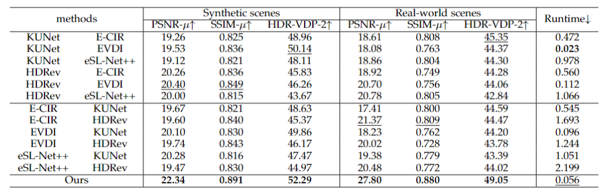
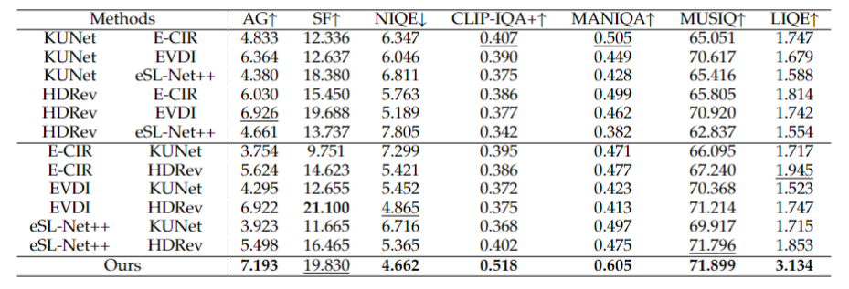

# Unlocking HDR Imaging for Dynamic Scenes with Events
## [Paper](https://arxiv.org/abs/) | [Website](https://)

High Dynamic Range Imaging (HDRI) for dynamic scenes often suffers from intensity saturation and motion blur because over/under exposures and fast-moving objects may occur simultaneously. Therefore, it is struggling to recover sharp latent HDR images from the blurry LDR input since the presence of motion blur inevitably aggravates the ill-posedness of HDRI. In this work, we propose an effective self-supervised Event-based HDRI framework to restore a sequence of Sharp HDR images from a single Blurry LDR input (E-BL2SH) where the burden of HDRI for dynamic scenes can be significantly relieved since events possess the property of extremely high temporal resolution and high dynamic range. Specifically, our E-BL2SH framework is composed of two branches, \ie the main branch for restoration of the saturated regions with over/under exposures and the sharp clear latent intensities, and the assistance branch to enable the main branch to be trained without ground-truth sharp HDR images and generate colorful and visually pleasing results. To evaluate the effectiveness of our method, we construct large-scale synthetic and real-world datasets for E-BL2SH, encompassing both static and dynamic HDR scenes with motion blurs, and each data sample is composed of the aligned blurry LDR image and corresponding events. Comprehensive experiments demonstrate that the proposed E-BL2SH outperforms state-of-the-art approaches by a large margin.

<center>
<div style="color:orange; border-bottom: 1px solid #d9d9d9;
    display: inline-block;
    color: #000;
    padding: 2px;">
      Quantitative comparisons on static HDR scenes with motion blurs
  	</div>
    
    <br>
</center>
<center>
<div style="color:orange; border-bottom: 1px solid #d9d9d9;
    display: inline-block;
    color: #000;
    padding: 2px;">
      Quantitative comparisons on dynamic HDR scenes with motion blurs
  	</div>
    
    <br>
</center>

## Environment setup
- Python 3.8.13
- Pytorch 2.0.0
- NVIDIA GPU + CUDA 11.7
  
You can create a new [Anaconda](https://www.anaconda.com/products/individual) environment as follows.
<br>
Clone this repository.
```
git clone https://github.com/lixiaopeng123456/E-BL2SH.git
```
Install the above dependencies.
```
cd E-BL2SH
conda env create -f EBL2SH.yaml
```

## EBL2SH-ERGB Dataset Benchmark

<br>
In our paper, we conduct experiments on three types of data:
- **Fastec-RS** contains synthetic RS images from [DeeplUnrollNet](https://github.com/ethliup/DeepUnrollNet). We first convert low frame rate into high frame rate GS videos using [Superslomo](https://github.com/avinashpaliwal/Super-SloMo), and then generate events by [V2E](https://github.com/SensorsINI/v2e).
- **Gev-RS** contains synthetic RS images and synthetic events from [EvUnroll](https://github.com/zxyemo/EvUnroll), where RS images are generated using the same manner as Fastec-RS.
- **Gev-Real-RS** contains real-world RS images and real-world events from [EvUnroll](https://github.com/zxyemo/EvUnroll).
- We built a real-world dataset **DRE** which contains real-world RS images and real-world events. (The data is coming soon.)
